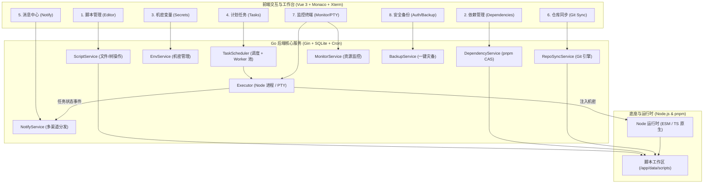

# 白虎面板极简版（Node.js & pnpm 专属）全功能开发指南 (Minimal Development Guideline)

本文档基于白虎面板（Baihu Panel）进行系统化重构设计，旨在提供一份**专注于 Node.js 与 pnpm 生态**，同时具备**生产级高可用、高安全性、多渠道告警、Git 仓库同步、系统监控与灾备恢复能力**的完整极简开发指南。配套代码级深度实现规范详见 [极简版核心开发深度规范 (Minimal Development Supplement)](./minimal-development-supplement.md)。

---

## 一、定位与架构原则

### 1. 核心定位
**Baihu Minimal (Node & pnpm Edition)** 是一个纯粹面向 JavaScript / TypeScript 开发者与自动化运维的现代化调度面板，专为单体容器或独立轻量 VPS/NAS 设计。

### 2. 架构裁剪与保留原则
- **剔除的冗余组件**：
  - 彻底剥离 Python、Go、Rust、Ruby、PHP、Java 等异构语言运行时及虚拟环境；
  - 彻底剥离 Mise 复杂的多语言插件链与跨语言包管理代码；
  - 剥离跨机器的子节点 Agent 通信与隧道穿透（回归单机极简高可用内核）。
- **完整保留并强化的 8 大核心能力**：
  1. **脚本管理与代码编辑**（Monaco Editor, VS Code 树形操作，原生 JS/TS/ESM）
  2. **依赖管理**（纯 Node.js & pnpm CAS 内容寻址，原生兼容 ESM 与 CJS）
  3. **机密与环境变量**（脱敏显示、AES-GCM 加密、自动注入子进程）
  4. **定时任务与高可用调度**（Cron 表达式、失败自动重试、随机防雪崩抖动、并发控制）
  5. **多渠道告警通知中心**（Telegram, 钉钉, 企微, 飞书, Bark, Email, Webhook, Server酱）
  6. **Git 仓库同步与脚本自动解析**（定时 Pull 仓库、单文件/稀疏检出、注释自动提取 Cron）
  7. **系统监控与执行器诊断**（CPU/内存/磁盘看板、调度器 Worker 实时状态、Web 终端 PTY）
  8. **安全审计与一键灾备恢复**（2FA/OTP 动态口令、OpenAPI 独立 Token、全量 JSON/Tar 备份还原）

---

## 二、精简技术栈选型

```
┌─────────────────────────────────────────────────────────────────────────────────────────────┐
│                             Baihu Minimal 核心技术选型                                       │
├───────────────────┬───────────────────────────────┬─────────────────────────────────────────┤
│ 模块              │ 选型技术                      │ 说明                                    │
├───────────────────┼───────────────────────────────┼─────────────────────────────────────────┤
│ **后端核心**      │ Go 1.22+ + Gin                │ 高并发、低内存占用 (基础常驻内存 < 35MB) │
│ **数据库与持久化**│ SQLite 3 (WAL 模式) + GORM     │ 单文件零维护，支持自动建表维护与热备份  │
│ **调度引擎**      │ robfig/cron/v3                │ 标准 5 位 / 6 位 Cron 表达式支持         │
│ **终端与流式交互**│ creack/pty + WebSocket / SSE  │ PTY 伪终端、实时流式执行日志输出        │
│ **前端框架**      │ Vue 3.5 + Vite 7 + TypeScript │ 极致响应速度与现代前端工程体验          │
│ **UI 与交互组件** │ Tailwind CSS 4 + Radix Vue    │ 现代化设计系统、深色模式支持            │
│ **核心编辑器**    │ Monaco Editor + Xterm.js      │ 完整 VS Code 代码编辑与终端仿真体验      │
│ **Node 运行时**   │ Node.js 24+ LTS (Alpine/Slim) │ 原生支持 TypeScript 剥离直接执行        │
│ **包管理器**      │ pnpm 11+ (Corepack 驱动)       │ 全局 CAS 内容寻址，秒级安装，节省 80% 磁盘│
└───────────────────┴───────────────────────────────┴─────────────────────────────────────────┘
```

---

## 三、八大必要功能详细设计规范



---

### 1. 脚本管理与代码编辑器 (Script Management)

#### 核心职责
管理 `/app/data/scripts` 工作区下的所有文件，提供类似 VS Code 的树形管理、Monaco 代码编辑、语法着色、快速调试与文件操作。

#### 支持格式
- **JavaScript / ECMAScript**：`.js`, `.mjs`, `.cjs`
- **TypeScript**：`.ts`, `.mts`, `.cts`（Node 24+ 原生直接执行，无需编译转译）
- **配置文件与说明**：`.json`, `.env`, `.md`, `.yaml`, `.sh`

#### 关键 API
- `GET /api/v1/files/tree`：获取多级文件目录树。
- `GET /api/v1/files/content?path=xxx`：获取文件内容。
- `POST /api/v1/files/content`：保存文件内容。
- `POST /api/v1/files/create` / `delete` / `rename` / `move`：节点文件操作。
- `POST /api/v1/files/upload` / `download` / `download-zip`：归档与文件传输。

---

### 2. 依赖管理模块 (Dependency Management - Pure Node & pnpm)

#### 核心职责
全面采用纯 Node.js & pnpm 生态体系，各类工具均使用原生默认配置，`/app/data` 作为 Node.js 项目根目录，`scripts/` 保持纯净脚本文件。

#### 核心机制
1. **项目自包含**：Node.js 项目根目录为 `/app/data`（包含 `package.json` 与 `node_modules/`），由 pnpm 默认缓存与寻址行为驱动。
2. **纯净脚本与原生寻址**：`/app/data/scripts` 保持纯净的脚本文件。Node.js 执行脚本时，原生向上递归至 `/app/data/node_modules` 寻址，天然支持 ESM、CommonJS 与 TypeScript，**无需任何 `NODE_PATH` 黑魔法**。
3. **数据模型 (`models.Dependency`)**：
   ```go
   type Dependency struct {
       ID        string    `json:"id" gorm:"primaryKey;size:20"`
       Name      string    `json:"name" gorm:"size:100;not null;index"`
       Version   string    `json:"version" gorm:"size:50"`
       Remark    string    `json:"remark" gorm:"size:255"`
       Log       string    `json:"log" gorm:"type:text"`
       CreatedAt time.Time `json:"created_at"`
       UpdatedAt time.Time `json:"updated_at"`
   }
   ```
4. **清单解析与智能自愈**：
   - 动态解析 `package.json`（支持 `dependencies`, `devDependencies`, `catalog:` 协议）；
   - 正则自动捕获 ESM 报错：`Cannot find (?:module|package)\s+'([^']+)'` 并支持命令行 `baihu depinstall <log_id>` 一键自动补齐。
5. **内置 SDK (`builtin/nodejs`)**：
   - 提供 Dual Package（`index.mjs` + `index.cjs` + `index.d.ts`），支持在脚本中 `import { notify } from 'baihu'` 或 `require('baihu')`。

---

### 3. 机密与环境变量管理 (Secret & Environment Management)

#### 核心职责
统一管理敏感 Token、Cookie、API 密钥及通用环境变量，执行前自动安全注入子进程。

#### 数据模型 (`models.EnvironmentVariable`)
```go
type EnvironmentVariable struct {
    ID        string    `json:"id" gorm:"primaryKey;size:20"`
    Name      string    `json:"name" gorm:"size:255;not null;uniqueIndex"`
    Value     string    `json:"value" gorm:"type:text"`               // 敏感机密支持 AES-256-GCM 密文存储
    Remark    string    `json:"remark" gorm:"size:500"`
    Type      string    `json:"type" gorm:"size:20;default:'normal'"` // normal 或 secret
    Hidden    bool      `json:"hidden" gorm:"default:true"`           // 前端是否脱敏显示 (***)
    Enabled   bool      `json:"enabled" gorm:"default:true"`          // 是否参与注入
    CreatedAt time.Time `json:"created_at"`
    UpdatedAt time.Time `json:"updated_at"`
}
```

#### 注入机制
任务执行前，后端读取所有 `Enabled == true` 的变量，自动组装追加至子进程的 `cmd.Env`，脚本内直接通过 `process.env.KEY` 获取。

---

### 4. 计划任务与高级调度引擎 (Scheduled Task Management)

#### 核心职责
基于 Cron 表达式提供定时调度、手动立即触发、失败重试、并发控制、超时熔断与执行日志归档。

#### 数据模型 (`models.Task` & `models.TaskLog`)
```go
type Task struct {
    ID            string     `json:"id" gorm:"primaryKey;size:20"`
    Name          string     `json:"name" gorm:"size:255;not null"`
    Command       string     `json:"command" gorm:"type:text"`             // 执行命令，如 node index.mjs 或 tsx test.ts
    Schedule      string     `json:"schedule" gorm:"size:100"`            // Cron 表达式 (如 0 0 * * *)
    Timeout       int        `json:"timeout" gorm:"default:30"`           // 超时分钟数 (Context 熔断)
    WorkDir       string     `json:"work_dir" gorm:"size:255"`            // 工作目录 (默认 /app/data/scripts)
    PreCommand    string     `json:"pre_command" gorm:"type:text"`        // 前置命令
    PostCommand   string     `json:"post_command" gorm:"type:text"`       // 后置命令
    RetryCount    int        `json:"retry_count" gorm:"default:0"`        // 失败重试次数
    RetryInterval int        `json:"retry_interval" gorm:"default:0"`     // 失败重试间隔 (秒)
    RandomRange   int        `json:"random_range" gorm:"default:0"`       // 随机延迟秒数 (防并发雪崩风暴)
    PinType       string     `json:"pin_type" gorm:"size:20;default:none"`// 置顶类型 (top/none)
    TriggerType   string     `json:"trigger_type" gorm:"size:25;default:cron"` // cron 或 baihu_startup (开机自启)
    Enabled       bool       `json:"enabled" gorm:"default:true"`
    Status        string     `json:"status" gorm:"size:20;default:'idle'"`// idle, running, queued
    LastRun       *time.Time `json:"last_run"`
    NextRun       *time.Time `json:"next_run"`
    CleanConfig   string     `json:"clean_config" gorm:"size:255"`        // 日志保留策略 (按天/按条数)
    CreatedAt     time.Time  `json:"created_at"`
    UpdatedAt     time.Time  `json:"updated_at"`
}

type TaskLog struct {
    ID        string    `json:"id" gorm:"primaryKey;size:20"`
    TaskID    string    `json:"task_id" gorm:"size:20;index"`
    Status    string    `json:"status" gorm:"size:20"` // success, failed, timeout, cancelled
    Duration  int64     `json:"duration"`              // 执行耗时 (毫秒)
    Output    string    `json:"output" gorm:"type:text"` // 执行终端输出 (Zstd/Gzip Base64 压缩存储)
    ExitCode  int       `json:"exit_code"`
    StartTime time.Time `json:"start_time"`
    EndTime   time.Time `json:"end_time"`
}
```

#### 现代执行引擎参数
```go
cmd.Env = append(cmd.Env,
    "TERM=xterm",
    "NODE_NO_WARNINGS=1",
    // 启用 Node 22+ 原生 TypeScript 剥离直接执行 (零构建)
    "NODE_OPTIONS=--experimental-strip-types --max-old-space-size=512",
)
```

---

### 5. 多渠道告警通知中心 (Notification Center)

#### 核心职责
当自动化任务在后台运行发生**失败、超时、成功**或系统发生**异常登录、开机启动**时，主动将告警信息推送到管理员的即时通讯工具中。

#### 支持的通知渠道
- **即时通讯**：Telegram Bot, 钉钉机器人 (DingTalk), 企业微信 (WeCom Webhook/应用), 飞书 (Feishu Webhook)
- **移动推送**：Bark (iOS 推送), Gotify, Ntfy, Server酱, PushDeer, WxPusher
- **通用协议**：自定义 Webhook (JSON POST), 邮件 (SMTP)

#### 事件驱动与过滤机制
- **支持事件**：`task_failed` (任务失败), `task_timeout` (任务超时), `task_success` (任务成功), `system_startup` (系统启动), `login_failed` (密码错误预警)；
- **智能过滤**：支持按任务名称正则、标签或执行耗时配置触发规则，避免消息轰炸；
- **脚本 SDK 调用**：支持在 Node.js 脚本中通过 `baihu.notify('标题', '内容')` 触发自定义通知。

---

### 6. Git 仓库同步与脚本自动解析 (Git Repo Sync & Discovery)

#### 核心职责
自动化运维的核心场景是从 GitHub / Gitee / 私有 GitLab 仓库定时拉取最新的任务脚本，并自动识别调度规则。

#### 核心机制
1. **同步策略**：
   - 支持全量 `git clone / pull`；
   - 支持**稀疏检出（Sparse-checkout）**与**单文件模式**（仅拉取特定子目录，节省网络与磁盘）；
   - 支持配置代理镜像（如 `ghproxy.net` 或企业内网 Git 镜像加速）。
2. **脚本注释自动提取定时任务 (Auto-Discovery)**：
   - 同步完成后，自动扫描 `.js` / `.ts` / `.mjs` 头部注释：
     ```javascript
     // cron "0 8 * * *"
     // name: 每日数据报表生成
     // timeout: 15
     ```
   - 自动在面板中创建或更新对应的定时任务，实现“Git 即配置，提交即生效”。

---

### 7. 系统监控与 Web 终端仿真器 (System Monitor & Web Terminal)

#### 核心职责
提供系统资源实时看板与免 SSH 依赖的浏览器端交互式终端，用于现场调试与诊断。

#### 核心能力
1. **实时性能监控 (Monitor)**：
   - 采集 CPU 使用率、物理内存占用与百分比、磁盘剩余空间、系统 Uptime；
   - **调度器 Worker 线程池健康看板**：展示当前并发任务数、队列积压量、各 Worker 正在执行的任务 ID 及持续时长，防止任务卡死占满并发池。
2. **全功能 Web 终端 (PTY Terminal)**：
   - 基于 `creack/pty` + `xterm.js`，支持完整的 ANSI 颜色高亮、Tab 键补全、快捷键与 Vim 编辑；
   - 预设快捷操作（一键执行 `pnpm store status`, `node -v`, `pnpm list -g`）。

---

### 8. 安全防护、2FA 与一键灾备恢复 (Security & Backup)

#### 核心职责
保障暴露在公网环境下的面板安全性，提供企业级鉴权防护与秒级全量灾备恢复能力。

#### 核心能力
1. **安全与认证体系**：
   - **双因子认证 (2FA / TOTP)**：支持 Google Authenticator / 1Password 动态二维码绑定与验证；
   - **OpenAPI 独立 Token 鉴权**：用于外部系统调用或脚本互调，支持设置有效期与权限范围，无需暴露主账户密码；
   - **防暴力破解**：同一 IP 连续密码错误自动临时拉黑，记录登录审计日志（IP、归属地、User-Agent）。
2. **一键灾备与备份恢复 (Backup & Restore)**：
   - **全量归档**：一键将 SQLite 数据库、任务配置、机密变量、通知设置及脚本目录打包为单一 `.tar.gz` 压缩包并支持浏览器下载；
   - **无损热恢复**：在全新容器或服务器上一键上传备份包，系统自动校验并无缝恢复所有配置。

---

## 四、极简项目目录结构规范

```
baihu-minimal/
├── cmd/
│   └── server/
│       └── main.go                 # 单一可执行文件入口
├── internal/
│   ├── config/                     # 配置加载与全局常量
│   ├── database/                   # SQLite 3 (WAL 模式) 连接池与 GORM
│   ├── models/                     # 数据模型 (Task, TaskLog, Env, Dep, User, Notify)
│   ├── controllers/                # RESTful API 控制器 (Gin Handlers)
│   │   ├── auth_controller.go      # 登录、2FA/OTP、OpenAPI 令牌
│   │   ├── file_controller.go      # 脚本文件管理与上传下载
│   │   ├── dep_controller.go       # pnpm 依赖管理与自动诊断
│   │   ├── env_controller.go       # 机密与环境变量管理
│   │   ├── task_controller.go      # 计划任务 CRUD、手动触发、停止
│   │   ├── notify_controller.go    # 通知渠道配置、测试、事件绑定
│   │   ├── repo_controller.go      # Git 仓库同步与脚本扫描
│   │   ├── monitor_controller.go   # CPU/内存/磁盘看板与 Worker 监控
│   │   ├── terminal_controller.go  # WebSocket PTY Web 终端
│   │   └── backup_controller.go    # 全量数据备份与恢复
│   ├── services/                   # 核心业务逻辑实现
│   │   ├── file_service.go
│   │   ├── dep_service.go (pnpm CAS 驱动)
│   │   ├── env_service.go
│   │   ├── task_service.go
│   │   ├── notification_service.go (多渠道分发引擎)
│   │   ├── repo_service.go (Git 同步与注释解析)
│   │   ├── monitor_service.go
│   │   └── backup_service.go (Tar.gz 导入导出)
│   ├── executor/                   # 调度引擎与执行器
│   │   ├── scheduler.go            # robfig/cron 调度池与防雪崩随机延迟
│   │   └── executor.go             # PTY 进程包装、超时熔断与实时日志流
│   └── builtin/
│       └── nodejs/                 # 内置 baihu SDK (CJS / ESM / TypeScript)
│           ├── package.json
│           ├── index.mjs
│           ├── index.cjs
│           └── index.d.ts
├── web/                            # 前端工程 (Vue 3 + Vite 7 + Tailwind 4 + Monaco)
│   ├── package.json
│   ├── pnpm-lock.yaml
│   └── src/
│       ├── views/
│       │   ├── dashboard/          # 系统状态与统计
│       │   ├── scripts/            # 脚本管理器与 Monaco 编辑器
│       │   ├── tasks/              # 计划任务与执行历史
│       │   ├── envs/               # 机密与环境变量
│       │   ├── deps/               # pnpm 依赖管理
│       │   ├── notify/             # 消息中心与渠道配置
│       │   ├── repo/               # Git 仓库同步
│       │   ├── monitor/            # 性能监控看板
│       │   ├── terminal/           # Web 终端仿真
│       │   └── settings/           # 系统设置、2FA、备份与恢复
├── docker/
│   ├── Dockerfile                  # 极简单容器 Dockerfile (基于 node:22-alpine)
│   └── docker-entrypoint.sh        # 容器初始化脚本
├── docker-compose.yml              # 一键拉起模板
├── Makefile                        # 快速构建指令
└── go.mod
```

---

## 五、极简生产 Dockerfile 与部署配置

### 1. 生产 Dockerfile (单容器完整交付)

```dockerfile
# ================================
# Stage 1: Build Web Frontend
# ================================
FROM node:24-alpine AS web-builder
WORKDIR /app/web
RUN corepack enable && corepack prepare pnpm@11.24.0 --activate
COPY web/package.json web/pnpm-lock.yaml ./
RUN pnpm install --frozen-lockfile
COPY web/ ./
RUN pnpm run build

# ================================
# Stage 2: Build Go Binary
# ================================
FROM golang:1.26-alpine AS server-builder
WORKDIR /app
COPY go.mod go.sum ./
RUN go mod download
COPY . .
COPY --from=web-builder /app/web/dist ./internal/static/dist
RUN CGO_ENABLED=0 go build -ldflags="-s -w" -o baihu cmd/main.go

# ================================
# Stage 3: Minimal Production Image
# ================================
FROM node:24-alpine
WORKDIR /app

ENV NODE_ENV=production
ENV PNPM_HOME=/root/.pnpm
ENV PATH="/app/data/node_modules/.bin:$PNPM_HOME/bin:$PNPM_HOME:/usr/local/bin:$PATH"

# 安装 Git (用于仓库同步) 及基础工具
RUN apk add --no-cache tzdata ca-certificates bash curl git openssh-client \
    && corepack enable && corepack prepare pnpm@11.24.0 --activate \
    && pnpm config set global-bin-dir /root/.pnpm/bin

# 拷贝二进制产物与内置 SDK
COPY --from=server-builder /app/baihu /usr/local/bin/baihu
COPY packages/baihu /app/packages/baihu
COPY docker/docker-entrypoint.sh .
RUN chmod +x docker-entrypoint.sh

EXPOSE 8052
VOLUME ["/app/data"]

ENTRYPOINT ["./docker-entrypoint.sh"]
```

### 2. docker-compose.yml 部署模板

```yaml
version: '3.8'

services:
  baihu:
    image: ghcr.io/uyloal/baihu:latest
    container_name: baihu
    restart: unless-stopped
    ports:
      - "8052:8052"
    environment:
      - TZ=Asia/Shanghai
    volumes:
      - ./data:/app/data          # 脚本、依赖与 SQLite 数据库全量持久化
      - ./configs:/app/configs    # 配置文件持久化 (可选)
```

---

## 六、总结

重构改造后的 **Baihu Minimal (Node & pnpm Edition)**：
1. **完整性与独立生产可用度达到 100%**：补全了告警通知、Git 仓库拉取、系统资源监控、2FA 安全与一键灾备，真正具备独立生产运维能力，支持纯净初始化与独立全量重新运行；
2. **纯粹与高性能**：坚守 Node.js + pnpm 纯净生态，镜像体积控制在 **~160MB**，内存常驻 **< 35MB**，安装依赖秒级完成，原生支持 TypeScript 与纯 ESM。

