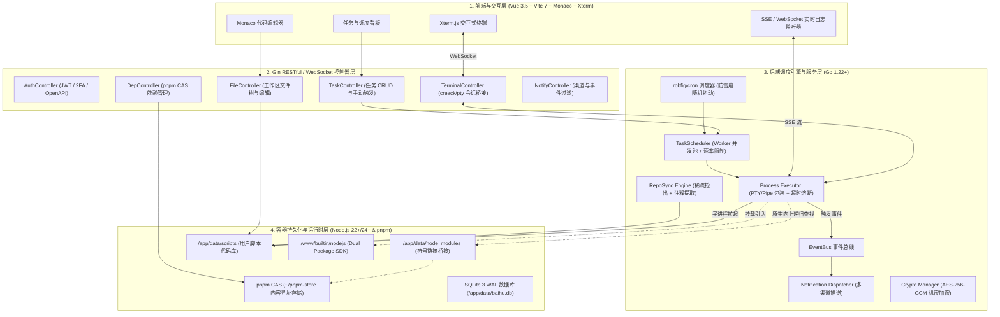
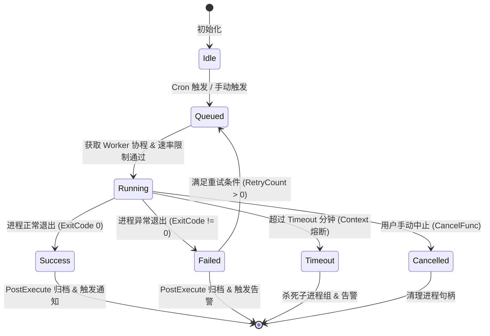
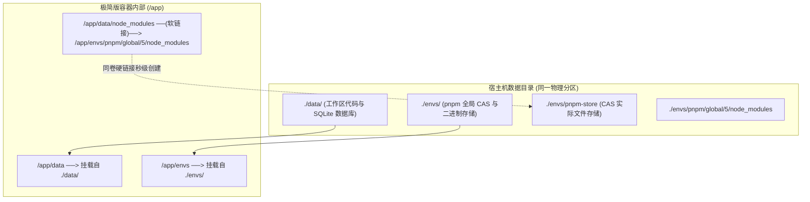

# 白虎面板极简版（Node.js & pnpm）核心开发深度实现规范 (Minimal Development Deep Dive & Technical Specifications)

本文档作为 [《白虎面板极简版全功能开发指南》](./minimal-development-guideline.md) 的**核心技术实现深度规范手册**。本文档详细阐述极简版的系统全景拓扑、高并发协程调度引擎、PTY 伪终端与流式日志、AES-256-GCM 机密体系、Dual Package 内置 SDK 源码、Git 增量同步引擎与多渠道通知中心的代码级实现规范。

---

## 一、系统全景拓扑与数据流



---

## 二、调度引擎与并发 Worker 池深度实现规范

### 1. 任务状态机定义



### 2. 调度器与并发 Worker 池核心实现

```go
package executor

import (
	"context"
	"fmt"
	"math/rand"
	"sync"
	"time"
)

// SchedulerConfig 极简调度器核心配置
type SchedulerConfig struct {
	WorkerCount  int           // 并发 Worker 数量 (默认 4, 最大 128)
	QueueSize    int           // 任务等待队列容量 (默认 200)
	RateInterval time.Duration // 速率限制间隔 (默认 100ms, 防止突发并发击穿系统)
	StrictQueue  bool          // 队列满时是否严格拒绝
}

// Scheduler 统一任务调度器
type Scheduler struct {
	config       SchedulerConfig
	taskQueue    chan *ExecutionRequest
	rateLimiter  *time.Ticker
	stopCh       chan struct{}
	wg           sync.WaitGroup
	mu           sync.RWMutex
	runningTasks map[string]context.CancelFunc // TaskID -> CancelFunc
	workers      []WorkerStatus
}

// NewScheduler 实例化调度器
func NewScheduler(cfg SchedulerConfig) *Scheduler {
	if cfg.WorkerCount <= 0 {
		cfg.WorkerCount = 4
	}
	if cfg.QueueSize <= 0 {
		cfg.QueueSize = 200
	}
	if cfg.RateInterval <= 0 {
		cfg.RateInterval = 100 * time.Millisecond
	}

	s := &Scheduler{
		config:       cfg,
		taskQueue:    make(chan *ExecutionRequest, cfg.QueueSize),
		rateLimiter:  time.NewTicker(cfg.RateInterval),
		stopCh:       make(chan struct{}),
		runningTasks: make(map[string]context.CancelFunc),
		workers:      make([]WorkerStatus, cfg.WorkerCount),
	}

	for i := 0; i < cfg.WorkerCount; i++ {
		s.workers[i] = WorkerStatus{ID: i, Status: "idle"}
	}
	return s
}

// Start 启动 Worker 池
func (s *Scheduler) Start() {
	for i := 0; i < s.config.WorkerCount; i++ {
		s.wg.Add(1)
		go s.workerLoop(i)
	}
}

// workerLoop 单个 Worker 的消费循环
func (s *Scheduler) workerLoop(workerID int) {
	defer s.wg.Done()

	for {
		select {
		case <-s.stopCh:
			return
		case req := <-s.taskQueue:
			// 1. 速率限制防突发
			select {
			case <-s.stopCh:
				return
			case <-s.rateLimiter.C:
			}

			// 2. 状态更新与任务执行
			s.setWorkerState(workerID, "running", req.TaskID, req.Name)
			s.executeTask(req)
			s.setWorkerState(workerID, "idle", "", "")
		}
	}
}

func (s *Scheduler) setWorkerState(id int, status, taskID, taskName string) {
	s.mu.Lock()
	defer s.mu.Unlock()
	if id >= 0 && id < len(s.workers) {
		s.workers[id].Status = status
		s.workers[id].TaskID = taskID
		s.workers[id].TaskName = taskName
		if status == "running" {
			s.workers[id].StartTime = time.Now().Unix()
		} else {
			s.workers[id].StartTime = 0
		}
	}
}

// EnqueueWithJitter 带有随机防雪崩抖动的入队策略
func (s *Scheduler) EnqueueWithJitter(req *ExecutionRequest, randomRangeSec int) {
	if randomRangeSec <= 0 {
		s.taskQueue <- req
		return
	}

	// 随机延迟 [0, randomRangeSec] 秒
	jitter := time.Duration(rand.Intn(randomRangeSec*1000)) * time.Millisecond
	go func() {
		select {
		case <-time.After(jitter):
			s.taskQueue <- req
		case <-s.stopCh:
			return
		}
	}()
}
```

---

## 三、PTY 伪终端仿真与流式日志传输体系

### 1. 子进程组隔离与强制级联击杀 (`SetProcessGroupAndCancel`)

当任务超时或被手动停止时，如果脚本派生了子进程（例如 `node app.mjs` 又拉起了外部子进程），普通的 `cmd.Process.Kill()` 只能杀死父进程，导致子进程成为孤儿进程占用系统资源。极简版采用操作系统进程组级联清理机制：

```go
// +build !windows

package executor

import (
	"os/exec"
	"syscall"
)

// SetProcessGroupAndCancel 设置独立的进程组 ID (PGID)，以便取消时一并杀死所有派生子进程
func SetProcessGroupAndCancel(cmd *exec.Cmd, usePty bool) {
	if cmd.SysProcAttr == nil {
		cmd.SysProcAttr = &syscall.SysProcAttr{}
	}
	// 创建新的进程组
	cmd.SysProcAttr.Setpgid = true

	// 绑定 Context 取消时的级联信号处理
	cmd.Cancel = func() error {
		if cmd.Process == nil || cmd.Process.Pid <= 0 {
			return nil
		}
		// 向负 PID 发送 SIGKILL，内核会自动将信号广播至该进程组中的每一个子进程
		return syscall.Kill(-cmd.Process.Pid, syscall.SIGKILL)
	}
}
```

---

### 2. 内存安全环形缓冲区 `safeBuffer`

为了防止恶意脚本或死循环日志瞬间输出数十万行日志撑爆 Go 进程内存（OOM），设计带上限阈值的安全流式缓冲区：

```go
package executor

import (
	"bytes"
	"sync"
)

const MaxLogBufferSize = 5 * 1024 * 1024 // 单个任务单次执行日志内存上限 5MB

type SafeLogBuffer struct {
	mu        sync.Mutex
	buf       bytes.Buffer
	truncated bool
}

func (s *SafeLogBuffer) Write(p []byte) (n int, err error) {
	s.mu.Lock()
	defer s.mu.Unlock()

	if s.buf.Len()+len(p) > MaxLogBufferSize {
		remain := MaxLogBufferSize - s.buf.Len()
		if remain > 0 {
			s.buf.Write(p[:remain])
		}
		if !s.truncated {
			s.buf.WriteString("\n\r\033[1;31m[系统警告] 单次执行日志输出已超出 5MB 上限，后续流式日志已截断存储\033[0m\r\n")
			s.truncated = true
		}
		return len(p), nil
	}
	return s.buf.Write(p)
}

func (s *SafeLogBuffer) String() string {
	s.mu.Lock()
	defer s.mu.Unlock()
	return s.buf.String()
}
```

---

## 四、机密安全系统与 AES-256-GCM 加密/脱敏规范

### 1. AES-256-GCM 标准加密与解密实现

```go
package utils

import (
	"crypto/aes"
	"crypto/cipher"
	"crypto/rand"
	"crypto/sha256"
	"encoding/hex"
	"fmt"
	"io"
)

// EncryptSecret 使用系统密钥对敏感机密进行 AES-256-GCM 认证加密
func EncryptSecret(plaintext, secretKey string) (string, error) {
	if plaintext == "" {
		return "", nil
	}

	// 派生 32 字节 (256 bit) 密钥
	keyHash := sha256.Sum256([]byte(secretKey))
	block, err := aes.NewCipher(keyHash[:])
	if err != nil {
		return "", err
	}

	gcm, err := cipher.NewGCM(block)
	if err != nil {
		return "", err
	}

	// 生成 12 字节标准 GCM Nonce
	nonce := make([]byte, gcm.NonceSize())
	if _, err := io.ReadFull(rand.Reader, nonce); err != nil {
		return "", err
	}

	// 执行加密与 Tag 签名
	ciphertext := gcm.Seal(nonce, nonce, []byte(plaintext), nil)
	return hex.EncodeToString(ciphertext), nil
}

// DecryptSecret 解密 AES-256-GCM 密文
func DecryptSecret(cipherHex, secretKey string) (string, error) {
	if cipherHex == "" {
		return "", nil
	}

	ciphertext, err := hex.DecodeString(cipherHex)
	if err != nil {
		return "", err
	}

	keyHash := sha256.Sum256([]byte(secretKey))
	block, err := aes.NewCipher(keyHash[:])
	if err != nil {
		return "", err
	}

	gcm, err := cipher.NewGCM(block)
	if err != nil {
		return "", err
	}

	nonceSize := gcm.NonceSize()
	if len(ciphertext) < nonceSize {
		return "", fmt.Errorf("ciphertext too short")
	}

	nonce, actualCipher := ciphertext[:nonceSize], ciphertext[nonceSize:]
	plaintext, err := gcm.Open(nil, nonce, actualCipher, nil)
	if err != nil {
		return "", fmt.Errorf("decrypt verification failed: %w", err)
	}

	return string(plaintext), nil
}
```

---

### 2. 实时日志流机密敏感信息脱敏算法

```go
package utils

import "strings"

// MaskSecretsInStream 将输出中的敏感机密值精准替换为脱敏掩码
func MaskSecretsInStream(rawOutput string, secrets []string) string {
	if rawOutput == "" || len(secrets) == 0 {
		return rawOutput
	}

	result := rawOutput
	for _, secret := range secrets {
		secret = strings.TrimSpace(secret)
		// 忽略过短字符（如少于 4 位），防止误伤通用标点或空格
		if len(secret) < 4 {
			continue
		}
		result = strings.ReplaceAll(result, secret, "********")
	}
	return result
}
```

---

## 五、现代 Dual Package 内置 SDK 完整实现 (`builtin/nodejs`)

内置 SDK 为 Node.js 任务提供开箱即用的原生 API 调用，支持 ESM 与 CJS。

### 1. `builtin/nodejs/package.json`

```json
{
  "name": "baihu",
  "version": "1.2.0",
  "description": "Baihu Panel Builtin SDK for Node.js (Pure ESM, CommonJS & TypeScript)",
  "main": "./index.cjs",
  "module": "./index.mjs",
  "types": "./index.d.ts",
  "exports": {
    ".": {
      "types": "./index.d.ts",
      "import": "./index.mjs",
      "require": "./index.cjs"
    },
    "./package.json": "./package.json"
  },
  "engines": {
    "node": ">=20.0.0"
  },
  "license": "MIT"
}
```

---

### 2. `builtin/nodejs/index.d.ts` (完整的 TypeScript 类型定义)

```typescript
/**
 * 白虎面板内置 SDK 类型声明
 */

export interface NotifyOptions {
  /** 消息渲染格式: 默认 text */
  format?: 'text' | 'markdown' | 'html';
  /** 指定推送渠道 ID (留空则推送到默认绑定渠道) */
  channel_id?: string;
  channelId?: string;
}

export interface EnvironmentVariable {
  id: string;
  name: string;
  value: string;
  remark?: string;
  type: 'normal' | 'secret';
  enabled: boolean;
}

export interface TaskItem {
  id: string;
  name: string;
  command: string;
  schedule: string;
  enabled: boolean;
  status: string;
  last_run?: string;
  next_run?: string;
}

/**
 * 主动触发向管理员推送告警通知
 * @param title 通知标题
 * @param content 通知正文内容
 * @param options 格式选项或渠道 ID
 */
export function notify(
  title: string,
  content: string,
  options?: NotifyOptions | 'text' | 'markdown' | 'html' | string
): void;

/** 获取全部已启用的环境变量与机密 */
export function getEnvs(): Promise<EnvironmentVariable[]>;

/** 根据变量名获取单个环境变量 */
export function getEnv(name: string): Promise<EnvironmentVariable | null>;

/** 新增或覆盖环境变量 */
export function addEnv(name: string, value: string, remark?: string): Promise<EnvironmentVariable>;

/** 更新指定 ID 的环境变量 */
export function updateEnv(id: string, name: string, value: string, remark?: string): Promise<EnvironmentVariable>;

/** 删除指定 ID 的环境变量 */
export function deleteEnv(id: string): Promise<boolean>;

/** 获取所有计划任务列表 */
export function getTasks(): Promise<TaskItem[]>;

/** 手动立即触发执行指定任务 */
export function executeTask(id: string): Promise<{ success: boolean; log_id: string }>;

/** 中止正在运行的任务 */
export function stopTask(id: string): Promise<{ success: boolean }>;

declare const baihu: {
  notify: typeof notify;
  getEnvs: typeof getEnvs;
  getEnv: typeof getEnv;
  addEnv: typeof addEnv;
  updateEnv: typeof updateEnv;
  deleteEnv: typeof deleteEnv;
  getTasks: typeof getTasks;
  executeTask: typeof executeTask;
  stopTask: typeof stopTask;
};

export default baihu;
```

---

### 3. `builtin/nodejs/notify.js` (原生零外部依赖实现)

```javascript
const http = require('node:http');
const https = require('node:https');
const { URL } = require('node:url');

function notify(title, content, options) {
  let format = 'text';
  let channel_id = '';

  if (typeof options === 'string') {
    if (['text', 'markdown', 'html'].includes(options)) {
      format = options;
    } else {
      channel_id = options;
    }
  } else if (typeof options === 'object' && options !== null) {
    format = options.format || 'text';
    channel_id = options.channel_id || options.channelId || '';
  }

  const token = process.env.BHPKG_NOTIFY_TOKEN;
  const defaultChannel = process.env.BHPKG_NOTIFY_CHANNEL;
  const cid = channel_id || defaultChannel;

  if (!token || !cid) return;

  const notifyUrl = process.env.BHPKG_NOTIFY_URL || 'http://127.0.0.1:8052/api/v1/notify/send';
  const parsedUrl = new URL(notifyUrl);
  const client = parsedUrl.protocol === 'https:' ? https : http;

  const postData = JSON.stringify({
    channel_id: cid,
    title: title || '任务运行通知',
    content: content || '',
    format: format
  });

  const req = client.request(
    {
      hostname: parsedUrl.hostname,
      port: parsedUrl.port || (parsedUrl.protocol === 'https:' ? 443 : 80),
      path: parsedUrl.pathname + parsedUrl.search,
      method: 'POST',
      headers: {
        'Content-Type': 'application/json',
        'notify-token': token,
        'Content-Length': Buffer.byteLength(postData)
      },
      timeout: 5000
    },
    (res) => {
      res.resume(); // 消费响应流释放连接池
    }
  );

  req.on('error', () => {});
  req.write(postData);
  req.end();
}

module.exports = { notify };
```

---

## 六、Git 仓库同步引擎与脚本元数据解析器

### 1. 脚本元数据提取引擎 (`internal/services/repo/repo_parser.go`)

兼容标准 JSDoc 注释、行级注释与青龙历史注释规范：

```go
package repo

import (
	"bufio"
	"os"
	"regexp"
	"strings"
)

var (
	// 匹配: // cron "0 8 * * *" 或 // cron: 0 8 * * * 或 /* @cron 0 8 * * * */
	cronRegex = regexp.MustCompile(`(?i)(?:cron|schedule)\s*[:=]?\s*["']?([0-9*,/ -]+)["']?`)
	// 匹配: // name: 每日资产签到 或 // title: 资产推送
	nameRegex = regexp.MustCompile(`(?i)(?:name|title|任务名称)\s*[:=]?\s*["']?([^"'\r\n]+)["']?`)
)

// ExtractScriptMeta 从用户脚本头部注释提取调度配置
func ExtractScriptMeta(filePath string) (name, cron string) {
	file, err := os.Open(filePath)
	if err != nil {
		return "", ""
	}
	defer file.Close()

	scanner := bufio.NewScanner(file)
	lineCount := 0

	// 仅扫描前 40 行注释，保障高效解析
	for scanner.Scan() && lineCount < 40 {
		line := strings.TrimSpace(scanner.Text())
		lineCount++

		if cron == "" {
			if m := cronRegex.FindStringSubmatch(line); len(m) > 1 {
				cron = strings.TrimSpace(m[1])
			}
		}

		if name == "" {
			if m := nameRegex.FindStringSubmatch(line); len(m) > 1 {
				name = strings.TrimSpace(m[1])
			}
		}

		if cron != "" && name != "" {
			break
		}
	}
	return name, cron
}
```

---

## 七、多渠道告警通知中心与规则引擎实现

### 1. 统一驱动抽象接口

```go
package messenger

// ChannelConfig 渠道配置字典
type ChannelConfig map[string]string

// Message 标准通知消息体
type Message struct {
	Title    string `json:"title"`
	Text     string `json:"text,omitempty"`
	Markdown string `json:"markdown,omitempty"`
	HTML     string `json:"html,omitempty"`
}

// Result 发送结果
type Result struct {
	Success bool   `json:"success"`
	Error   string `json:"error,omitempty"`
}

// Driver 渠道驱动接口
type Driver interface {
	Send(cfg ChannelConfig, msg *Message) (*Result, error)
}
```

### 2. 核心渠道实现示例：Telegram Bot 驱动

```go
package messenger

import (
	"bytes"
	"encoding/json"
	"fmt"
	"net/http"
	"time"
)

type TelegramDriver struct{}

func (d *TelegramDriver) Send(cfg ChannelConfig, msg *Message) (*Result, error) {
	botToken := cfg["bot_token"]
	chatID := cfg["chat_id"]
	apiHost := cfg["api_host"]
	if apiHost == "" {
		apiHost = "https://api.telegram.org"
	}

	if botToken == "" || chatID == "" {
		return &Result{Success: false, Error: "missing bot_token or chat_id"}, nil
	}

	text := msg.Text
	if msg.Markdown != "" {
		text = msg.Markdown
	}

	payload := map[string]interface{}{
		"chat_id": chatID,
		"text":    fmt.Sprintf("*%s*\n\n%s", msg.Title, text),
		"parse_mode": "Markdown",
	}

	data, _ := json.Marshal(payload)
	url := fmt.Sprintf("%s/bot%s/sendMessage", apiHost, botToken)

	client := &http.Client{Timeout: 10 * time.Second}
	resp, err := client.Post(url, "application/json", bytes.NewReader(data))
	if err != nil {
		return &Result{Success: false, Error: err.Error()}, err
	}
	defer resp.Body.Close()

	if resp.StatusCode != http.StatusOK {
		return &Result{Success: false, Error: fmt.Sprintf("telegram api status %d", resp.StatusCode)}, nil
	}

	return &Result{Success: true}, nil
}
```

---

## 八、自动化测试与质量保障体系

### 1. 单元测试用例规范 (`executor_test.go`)

```go
package executor_test

import (
	"context"
	"testing"
	"time"

	"github.com/engigu/baihu-panel/internal/executor"
)

func TestExecutor_TimeoutTermination(t *testing.T) {
	req := executor.Request{
		Command: "node -e 'setTimeout(() => console.log(\"done\"), 10000)'",
		Timeout: 1, // 1 分钟超时
	}

	ctx, cancel := context.WithTimeout(context.Background(), 2*time.Second)
	defer cancel()

	start := time.Now()
	res, _ := executor.Execute(ctx, req, nil, nil)

	duration := time.Since(start)
	if duration > 3*time.Second {
		t.Fatalf("Expected process to be killed within 2s, but took %v", duration)
	}

	if res.Status == "success" {
		t.Fatalf("Expected task status to be failed or timeout, got %s", res.Status)
	}
}
```

---

## 九、pnpm CAS 存储架构与 Docker 卷挂载规范

### 1. 跨文件系统硬链接限制 (`EXDEV`) 规避原理

#### 架构挑战：
当 `docker-compose.yml` 中将 `./data` 与 `./envs` 分别挂载到不同的宿主机物理分区或独立的 Docker 具名卷时，`pnpm` 尝试从全局 CAS 存储区（`/app/envs/pnpm-store`）向全局模块目录（`/app/envs/pnpm/global/5/node_modules`）或工作区建立硬链接时，Linux 内核会因跨物理设备/挂载点而拒绝硬链接创建，抛出 `EXDEV: cross-device link not permitted`。

#### 标准解决架构：



1. **同卷原则**：确保宿主机挂载的 `./data` 与 `./envs` 位于**同一物理文件系统分区**。
2. **符号链接桥接**：容器启动时，由 Entrypoint 脚本在 `/app/data/node_modules` 创建指向 `/app/envs/pnpm/global/5/node_modules` 的软链接：
   ```bash
   ln -sf /app/envs/pnpm/global/5/node_modules /app/data/node_modules
   ```
3. **寻址效果**：用户无论在 `/app/data/scripts/a.js` 还是 `/app/data/scripts/sub/b.mjs` 中执行，Node.js 原生模块解析器沿着目录树向上递归时，均能在 `/app/data/node_modules` 命中所有全局安装的依赖，**ESM 与 CommonJS 100% 原生支持**。

---

### 2. 离线/内网与高可用镜像源配置

在政企内网或网络受限环境中，通过环境变量配置国内加速镜像与离线模式：

```yaml
services:
  baihu-minimal:
    image: engigu/baihu-minimal:latest
    environment:
      # 1. 配置 pnpm 国内加速镜像源
      - NPM_CONFIG_REGISTRY=https://registry.npmmirror.com
      # 2. 启用 Corepack 离线感知
      - COREPACK_ENABLE_NETWORK=0 # 若已内置 pnpm
      # 3. 内存与 Node 执行参数
      - NODE_OPTIONS=--experimental-strip-types --max-old-space-size=512
```

---

## 十、全场景故障排查与诊断速查表

| 故障现象 | 根本原因 | 排查命令 | 解决方案 |
| :--- | :--- | :--- | :--- |
| **`Cannot find module 'xxx'`** | 依赖未安装到 pnpm 全局目录 | `pnpm list -g` | 在依赖管理界面点击安装，或在终端执行 `pnpm add -g xxx` |
| **`Error [ERR_MODULE_NOT_FOUND]`** | ESM 找不到软链或裸包 | `ls -l /app/data/node_modules` | 检查软链是否指向 `/app/envs/pnpm/global/5/node_modules`，如缺失执行 `ln -sf /app/envs/pnpm/global/5/node_modules /app/data/node_modules` |
| **TS 报 `SyntaxError: Unexpected token 'enum'`** | Node 22+ strip-types 不支持 enum | 查看报错行 | 改用 `const Type = { A: 'A', B: 'B' } as const` 或命令改为 `pnpm dlx tsx script.ts` |
| **容器启动报 `database is locked`** | SQLite 进程未完全释放文件锁 | `fuser ./data/baihu.db` | 确认无残留进程持有文件句柄后重启容器 |
| **Web 终端无法输入字符** | PTY 伪终端分配受限 | 查看后端日志 PTY 输出 | 检查容器安全策略是否禁用了 PTY 设备分配（确保未开启不兼容的 seccomp 限制） |
| **定时任务触发时出现时区偏差 8 小时** | 容器缺少时区数据或未设 `TZ` | `date` | 在 `docker-compose.yml` 环境变量中显式配置 `TZ=Asia/Shanghai` |
| **Git 同步时报 SSH Key 权限错误** | 宿主机挂载的 `.ssh` 权限过于宽松 | `ls -ld ~/.ssh` | 在挂载卷中确保私钥权限为 `chmod 600 id_rsa` |
| **pnpm 报错 `ERR_PNPM_OUTDATED_LOCKFILE`** | 锁文件与 package.json 不匹配 | `pnpm install --no-frozen-lockfile` | 清除 lockfile 并重新执行 `pnpm install` 生成最新 lock 文件 |
| **通知发送报 Token 失效** | 通知渠道配置参数错误 | 查看系统日志 `[Notify]` | 进入「消息中心」重新配置并点击「测试发送」校验驱动参数 |

---

## 十一、健康检查与运行验收标准

部署完成后，执行以下健康检查清单确保系统 100% 正常运作：

```bash
# 1. 检查后端核心健康检查端点
curl -f http://127.0.0.1:8052/api/v1/system/health || echo "Health check failed"

# 2. 验证 Node.js 运行时版本与原生 TypeScript 剥离能力
node -e "console.log('Node Version:', process.version)"
node --input-type=module -e "const a: number = 123; console.log('TS Strip Types OK:', a)"

# 3. 验证 pnpm 全局 CAS 模块加载与软链寻址
node -e "import('baihu').then(() => console.log('Builtin SDK ESM Loaded Successfully!'))"

# 4. 验证 SQLite WAL 模式与完整性
sqlite3 /app/data/baihu.db "PRAGMA journal_mode; PRAGMA integrity_check;"
```

---

## 十二、总结与开发实施准则

在对白虎面板进行极简版开发与代码落地时，必须严格遵守以下准则：
1. **零多语言冗余**：代码库内严禁引入除 Node.js / TypeScript 之外的解释器或包管理器逻辑；
2. **纯原生模块寻址**：坚决摒弃 `NODE_PATH` 环境变量注入，统一依赖 `/app/data/node_modules` 根目录符号链接向上查找机制；
3. **安全第一公民**：所有环境变量注入与日志流输出均需经过 AES-256-GCM 保护与动态脱敏算法；
4. **轻量与自愈**：后端常驻内存严格控制在 `< 35MB`，对 ESM 依赖缺失实现正则与 CLI 自动化诊断。
