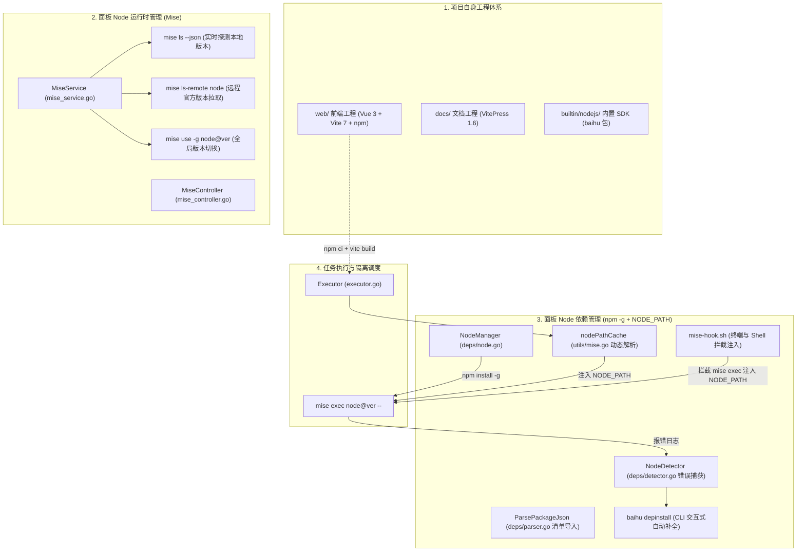

# Node.js 与依赖管理现状分析 (旧版架构基线)

本文档全面梳理白虎面板（Baihu Panel）在重构前的**旧版多语言架构体系**中，Node.js 相关的工程、运行时调度与依赖管理机制。本文档作为架构调研的技术基线存档；当前项目已确立**直接改造为极简版（Baihu Minimal）并全新独立运行**，不再采用针对旧版生产环境的增量迁移或向下兼容过渡方案。

---

## 一、系统架构全景

在白虎面板中，Node.js 相关的管理涵盖了从项目源码构建、容器镜像打包，到底层多版本运行时调度与用户任务执行的全链路：



---

## 二、项目自身的 Node.js 与依赖管理

白虎面板源码仓库内包含三个独立的 Node.js 子工程，各工程职责清晰、独立管理：

### 1. 前端管理后台 (`web/`)
- **技术栈**：Vue 3.5 + TypeScript 5.9 + Vite 7 + Tailwind CSS 4 + Radix Vue / Reka UI + Monaco Editor + Xterm.js。
- **包管理器**：使用标准 `npm`，配有 `web/package.json` 与 `web/package-lock.json`。
- **依赖安全覆盖 (`overrides`)**：在 `web/package.json` 中配置了 `overrides` 字段，统一锁定底层传递依赖（如 `esbuild`, `nanoid`, `fast-uri`, `brace-expansion`）的版本，规避安全漏洞与构建异常。
- **构建与嵌入机制**：
  - 构建指令：`npm ci && npm run build`（执行 `vue-tsc -b && vite build`）。
  - 打包集成：通过 `Makefile`（`make release`）将构建产物 `web/dist` 拷贝至 `internal/static/dist`，利用 Go 1.16+ 原生 `//go:embed` 机制嵌入到最终的二进制可执行文件中，实现单文件分发。

### 2. 项目文档站 (`docs/`)
- **技术栈**：VitePress 1.6 + Node.js 24。
- **包管理**：使用独立的 `docs/package.json` 与 `docs/package-lock.json`。
- **CI/CD 流水线**：在 `.github/workflows/docs-deploy.yml` 中通过 `actions/setup-node@v6` 激活 Node.js 24 并配置 `cache: 'npm'`，自动化完成 Swagger 文档生成与 VitePress 静态页面部署到 GitHub Pages。

### 3. 面板内置 SDK (`builtin/nodejs/`)
- **轻量零依赖设计**：`builtin/nodejs/package.json` 声明了一个名为 `baihu` 的内置 Node 模块。
- **功能模块划分**：
  - `index.js`：统一导出入口。
  - `notify.js`：仅基于原生 `http` / `https` 模块实现与面板消息中心的通知交互。
  - `env.js`：实现对面板环境变量的增删改查。
  - `task.js`：实现对面板定时任务的查询与触发。
- **全局分发机制**：通过 CLI 命令 `baihu builtininstall` 遍历 Mise 中安装的所有 Node.js 版本，自动运行 `npm i -g /www/builtin/nodejs` 将 SDK 分发至全局。

### 4. 容器化构建与 CI/CD
- **多阶段构建**：`docker/Dockerfile` Stage 1 采用 `node:20-alpine AS frontend-builder`，结合 `RUN --mount=type=cache,target=/root/.npm npm ci` 高效利用缓存构建前端。
- **跨平台打包**：`.github/workflows/release.yml` 统一基于 Node.js 24 构建前端资源，并交叉编译 Linux, macOS, Windows, Android Termux 各架构二进制包。

---

## 三、面板作为管理平台的 Node.js 运行时环境管理

白虎面板深度集成了开源多版本运行时管理器 **Mise**，实现多版本 Node.js 的动态安装、版本隔离与全局切换：

### 1. 运行时版本实时探测与数据库同步
- **实时探测**：后端 `MiseService.fetchLiveLanguages` 执行 `mise ls --json`，解析系统中当前已安装的 Node.js 版本及其实际安装路径。
- **元数据丰富**：`MiseService.enrichInstallDates` 通过探测安装目录的修改时间推算环境安装日期。
- **异步同步**：`MiseService.syncToDB` 将检测到的环境同步到 SQLite/MySQL 数据库 `models.Language` 表中，并自动删除已在系统中被移除的失效记录。

### 2. 远程版本查询与动态安装
- **版本列表拉取**：`MiseService.Versions` 执行 `mise ls-remote node` 动态拉取 Node.js 官方版本库（倒序截取最新 300 条供 Web 界面展示）。
- **前端可视化管理**：在 `Languages.vue` 中支持一键检索并安装指定版本（如 18.x, 20.x, 22.x, 23.x 等）。

### 3. 全局默认版本与命令验证
- **全局切换**：`MiseService.UseGlobal` 与 `UnsetGlobal` 调用 `mise use -g node@<version>` 或 `mise unuse -g` 管理全局默认版本。
- **环境验证**：`MiseService.GetVerifyCommand` 获取验证指令 `node -v`。

### 4. 任务调度时的环境隔离执行
- **命令动态构建**：在 `internal/utils/mise.go` 中，任务执行器将脚本执行包装为：
  ```bash
  mise exec node@<version> -- <command>
  ```
  多语言复合环境任务包装为：
  ```bash
  mise exec python@3.12 node@22.0.0 -- <command>
  ```
- **进程级隔离**：不同任务可绑定完全不同的 Node.js 版本，各自在独立进程环境中运行。

### 5. 容器内初始化与持久化
- **基础镜像预置**：`docker/Dockerfile.base` 在构建时预装 Mise，并执行 `mise use -g node@${NODE_VERSION}` 安装默认运行时至 `/opt/mise-base`。
- **持久化同步**：`docker/docker-entrypoint.sh` 在容器启动时通过 `rsync -a --ignore-existing /opt/mise-base/ /app/envs/mise/` 同步至挂载卷，并配置环境变量：
  ```bash
  export MISE_DATA_DIR="/app/envs/mise"
  export MISE_CONFIG_DIR="/app/envs/mise"
  export PATH="/app/envs/mise/shims:/app/envs/mise/bin:$PATH"
  export NODE_OPTIONS="--max-old-space-size=256"
  ```

---

## 四、面板作为管理平台的 Node 依赖管理机制

Node.js 在通过 `npm install -g` 全局安装模块后，用户脚本若使用 `require('xxx')`，默认不会去查找全局 `node_modules`。白虎面板设计了完整的依赖安装、寻址注入与错误自愈机制：

### 1. 数据模型与持久化 (`models.Dependency`)
- 表结构 `prefix_deps` 包含字段：`id`, `name`, `version`, `language` (node), `lang_version` (如 22.1.0), `remark`, `log` (最近一次安装/卸载执行日志)。

### 2. Node 依赖管理器底层实现 (`NodeManager`)
- 位于 `internal/services/deps/node.go`，继承自 `BaseManager`：
  - **安装**：在对应 Node 版本的 Mise 环境中执行 `npm install -g <name>[@<version>]`。
  - **卸载**：`npm uninstall -g <name>`。
  - **列表**：`npm list -g --depth=0 --json` 结构化读取全局包列表。
  - **环境验证**：`node -v`。

### 3. 清单解析与一键批量导入 (`ParsePackageJson`)
- 位于 `internal/services/deps/parser.go`：
  - 解析用户上传或粘贴的 `package.json` 内容。
  - 自动提取 `dependencies` 与 `devDependencies`（备注标注 `devDependencies`）。
  - 自动剥离 `^`, `~`, `>=`, 等语义化修饰符，提取确定版本号。
  - 支持一键入库并生成合并批量安装命令。

### 4. `NODE_PATH` 自动解析与注入机制
- **Go 后端动态缓存注入**：
  - `internal/utils/mise.go` 中的 `GetMiseNodePath` 通过 `mise where node@<version>` 查询安装路径。
  - Linux/Docker 适配双路径：`nodeDir + "/lib/node_modules:" + nodeDir + "/lib"`。
  - Windows 适配：`filepath.Join(nodeDir, "node_modules")`。
  - 使用 `sync.Map`（`nodePathCache`）进行并发安全缓存。
  - 在任务执行前通过 `InjectNodePath` 自动将 `NODE_PATH` 注入进程环境变量。
- **Docker / 终端 Shell Hook 拦截器**：
  - `docker/mise-hook.sh` 在系统 Profile 中导出 `mise()` 拦截函数。
  - 用户在 Web 终端或命令行执行 `mise exec node...` 时，拦截器自动解析 node 版本并注入 `NODE_PATH`，确保终端手动调试与面板后台执行行为完全一致。

### 5. 依赖缺失智能检测与命令行自愈 (`baihu depinstall`)
- **错误捕获**：`internal/services/deps/detector.go` 中的 `NodeDetector` 使用正则匹配任务日志中的 `Cannot find module '([^']+)'`。
- **CLI 交互式补全**：`cmd/depinstall/depinstall.go` 提供 `baihu depinstall <log_id>` 命令，从失败日志中自动提取缺失的 npm 包并在对应 Node 版本下自动调用 `npm install -g` 补齐安装，安装成功后自动同步至数据库。

---

## 五、现状机制总结与局限性对照

| 管理维度 | 现状实现机制 | 核心优势 | 存在的局限性 |
| :--- | :--- | :--- | :--- |
| **运行时版本管理** | 基于 Mise CLI 实时探测与调度 | 多语言一体化、切换便捷、与 Docker 持久化结合好 | 缺少对 Corepack 声明式工具链的原生感知 |
| **依赖包安装模式** | `npm install -g` (全局安装模式) | 所有任务与终端统一引用，配置简单 | 容易产生全局冲突，安装速度受限 |
| **模块解析与寻址** | 依赖 `NODE_PATH` 环境变量动态注入 | 解决 CJS 模式下全局包的 `require()` 寻址 | **ESM 模式下 `import` 原生忽略 `NODE_PATH`，直接报错** |
| **内置 SDK 支持** | `builtin/nodejs` 全局安装 | 零外部依赖，提供开箱即用推送与环境 API | 仅支持 CommonJS，缺少原生 ESM 条件导出与类型定义 |
| **依赖自愈诊断** | 正则匹配 `Cannot find module` | 支持命令行一键修复缺失依赖 | 无法捕获 ESM `[ERR_MODULE_NOT_FOUND]` 及 TypeScript 报错 |
