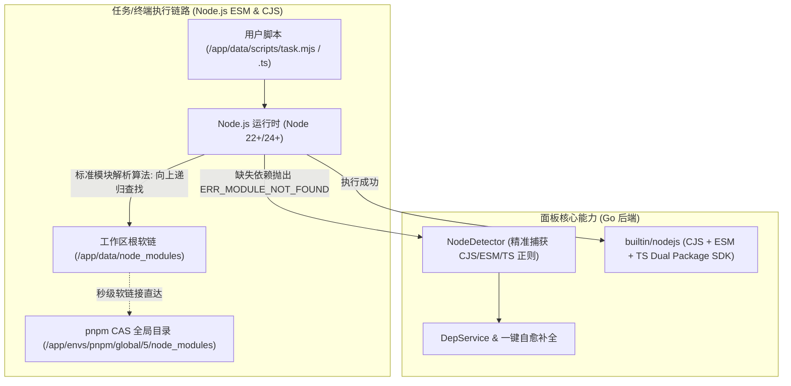

# Node.js ESM 原生支持与架构研究

本文档针对白虎面板在支持 **Node.js 原生 ECMAScript Modules（ESM，即 `import / export`、`.mjs`、`"type": "module"`）** 场景下的核心障碍进行技术剖析，并结合 **极简版（Baihu Minimal）全新独立运行架构** 提供彻底、高效的原生解决方案。

---

## 一、问题背景与技术障碍分析

现代 JavaScript 生态中，越来越多的 npm 依赖包已转向纯 ESM 模块（Pure ESM，如最新版 `node-fetch`, `chalk`, `execa`, `lodash-es` 等），支持 ESM 已成为现代运维调度平台的刚需。然而，在传统调度架构下引入 ESM 时，会面临以下 4 个关键障碍：

```
┌─────────────────────────────────────────────────────────────────────────────────────────────┐
│ 核心技术障碍: Node.js 官方规范规定 ESM 解析器 (import) 原生完全忽略 NODE_PATH 环境变量!          │
├─────────────────────────────────────────────────────────────────────────────────────────────┤
│ 1. CommonJS 模式 (require):                                                                 │
│    npm install -g axios ──> 安装到全局目录 ──> 注入 NODE_PATH ──> require('axios') [成功]     │
│                                                                                             │
│ 2. ECMAScript Modules 模式 (import):                                                        │
│    npm install -g axios ──> 安装到全局目录 ──> 注入 NODE_PATH ──> import 'axios' [直接报错失败] │
│    ↳ 报错: Error [ERR_MODULE_NOT_FOUND]: Cannot find package 'axios' imported from ...      │
│    ↳ 根因: Node.js ESM 寻址仅向上递归父级目录查找 node_modules，严格不读取 NODE_PATH!            │
└─────────────────────────────────────────────────────────────────────────────────────────────┘
```

### 1. 核心障碍一：`NODE_PATH` 在 ESM 解析链中完全失效
- **现象**：在旧版架构中安装了全局依赖（如 `axios`）或内置 SDK `baihu`，在 `.js` 脚本中使用 `const { notify } = require('baihu')` 运行正常；但若改为 `.mjs` 或在配置了 `"type": "module"` 的目录下执行 `import { notify } from 'baihu'`，Node.js 将直接抛出：
  ```text
  Error [ERR_MODULE_NOT_FOUND]: Cannot find package 'baihu' imported from /app/data/scripts/task.mjs
  ```
- **根因**：Node.js 官方为了保障 ESM 规范与浏览器行为的确定性，在 ESM 模块解析算法（`packageResolve`）中彻底移除了对 `NODE_PATH` 环境变量的支持。全局安装的 npm 包默认无法被 ESM 脚本加载。

### 2. 核心障碍二：依赖缺失检测器 `NodeDetector` 无法识别 ESM 报错
- **现象**：当 ESM 任务脚本由于缺少某个 npm 依赖运行失败时，`baihu depinstall <log_id>` 命令行工具和 Web 端依赖建议均提示“未检测到缺失依赖”。
- **根因**：在旧版 `internal/services/deps/detector.go` 中，现有的正则表达式仅匹配 CJS 报错：
  ```go
  nodeRegex1 := regexp.MustCompile(`Error: Cannot find module '([^']+)'`)
  nodeRegex2 := regexp.MustCompile(`Cannot find module '([^']+)'`)
  ```
  而 Node.js 在 ESM 下抛出的是带错误码的 package 报错：
  ```text
  Error [ERR_MODULE_NOT_FOUND]: Cannot find package 'lodash-es' imported from /app/data/scripts/demo.mjs
  ```
  旧正则缺少对 `[ERR_MODULE_NOT_FOUND]` 及 `Cannot find package` 关键字的匹配，导致检测完全脱靶。

### 3. 核心障碍三：内置 SDK `builtin/nodejs` 缺少 Dual Package 支持
- **现象**：用户脚本如果使用 `import { notify } from 'baihu'`，可能会遭遇解构导出失败或类型导出不兼容问题。
- **根因**：旧版 `builtin/nodejs/package.json` 仅声明了 `"main": "index.js"`，代码全部使用 CommonJS（`module.exports`）。缺少现代 Node.js 的 `"exports"` 条件导出配置与原生的 `.mjs` 模块定义及 TypeScript 类型声明。

### 4. 核心障碍四：Web 端编辑器与脚本执行器对 `.mjs` / `.cjs` / `.ts` 映射缺失
- **现象**：
  1. 在 `web/src/constants/index.ts` 的 `FILE_RUNNERS` 中，仅注册了 `js: 'node'`，缺少 `mjs`、`cjs`、`ts`，导致在 Web 脚本编辑器中点击直接运行时无法自动匹配 `node` 执行器；
  2. 在 `web/src/views/editor/Editor.vue` 中，Monaco 编辑器的语言映射未将 `.mjs` / `.cjs` / `.mts` / `.cts` 映射至 `javascript` / `typescript`。

---

## 二、极简版原生架构解决方案

在进行 Minimal 极简版重构并全新独立运行时，我们**摒弃了旧版复杂的 Loader 动态劫持与 `NODE_PATH` 兼容垫片**，直接采用 **“pnpm CAS + 根目录软链桥接 + Dual Package SDK + 智能诊断升级”** 的纯原生架构方案：



### 为什么选择软链桥接而非 Loader 劫持？
1. **零性能损耗**：Node.js 原生模块解析算法在向上寻找父目录的 `node_modules` 时命中 `/app/data/node_modules`，无需在 Node 启动时注入 `--import loader.mjs` 钩子，执行冷启动开销为 0；
2. **100% 原生兼容**：无论用户执行 `node index.mjs`、`node index.cjs` 还是 `node script.ts`，Node.js 原生解析行为完全一致，终端调试与调度器运行表现完全相同；
3. **彻底告别 `NODE_PATH`**：不需要向子进程注入任何非标准的 `NODE_PATH` 环境变量。

---

## 三、代码级修改清单

### 1. 容器层：工作区根目录符号链接桥接

在容器启动 Entrypoint（`docker/docker-entrypoint.sh`）中，确保工作区根目录建立指向 pnpm 全局目录的符号链接：

```bash
# 建立 scripts 根目录 node_modules 软链接以实现 ESM / CJS 原生向上寻址
mkdir -p "$PNPM_HOME/global/5/node_modules"
ln -sf "$PNPM_HOME/global/5/node_modules" /app/data/node_modules
```

---

### 2. 内置 SDK 改造为现代 Dual Package（CJS + ESM + TypeScript）

让用户在 ESM 下使用 `import { notify } from 'baihu'` 或 `import baihu from 'baihu'`，在 CJS 下使用 `require('baihu')`，在 TypeScript 下享有完整类型补全：

#### 修改文件：`builtin/nodejs/package.json`
```json
{
  "name": "baihu",
  "version": "1.2.0",
  "description": "Baihu Panel Builtin SDK for Node.js (Pure ESM, CommonJS & TypeScript)",
  "main": "./index.cjs",
  "module": "./index.mjs",
  "types": "./index.d.ts",
  "exports": {
    ".": {
      "types": "./index.d.ts",
      "import": "./index.mjs",
      "require": "./index.cjs"
    },
    "./package.json": "./package.json"
  },
  "engines": {
    "node": ">=20.0.0"
  },
  "license": "MIT"
}
```

#### 新增文件：`builtin/nodejs/index.mjs`
```javascript
import { notify } from './notify.js';
import { getEnvs, getEnv, addEnv, updateEnv, deleteEnv } from './env.js';
import { getTasks, executeTask, stopTask } from './task.js';

export {
  notify,
  getEnvs,
  getEnv,
  addEnv,
  updateEnv,
  deleteEnv,
  getTasks,
  executeTask,
  stopTask
};

export default {
  notify,
  getEnvs,
  getEnv,
  addEnv,
  updateEnv,
  deleteEnv,
  getTasks,
  executeTask,
  stopTask
};
```

#### 新增文件：`builtin/nodejs/index.d.ts`
```typescript
export interface NotifyOptions {
  format?: 'text' | 'markdown' | 'html';
  channel_id?: string;
  channelId?: string;
}

export function notify(title: string, content: string, options?: NotifyOptions | string): void;
export function getEnvs(): Promise<Array<{ id: string; name: string; value: string; remark?: string }>>;
export function getEnv(name: string): Promise<{ id: string; name: string; value: string; remark?: string } | null>;
export function addEnv(name: string, value: string, remark?: string): Promise<any>;
export function updateEnv(id: string, name: string, value: string, remark?: string): Promise<any>;
export function deleteEnv(id: string): Promise<boolean>;
export function getTasks(): Promise<Array<{ id: string; name: string; schedule?: string; command?: string }>>;
export function executeTask(id: string): Promise<any>;
export function stopTask(id: string): Promise<any>;

declare const baihu: {
  notify: typeof notify;
  getEnvs: typeof getEnvs;
  getEnv: typeof getEnv;
  addEnv: typeof addEnv;
  updateEnv: typeof updateEnv;
  deleteEnv: typeof deleteEnv;
  getTasks: typeof getTasks;
  executeTask: typeof executeTask;
  stopTask: typeof stopTask;
};

export default baihu;
```

---

### 3. 后端依赖缺失检测器支持 ESM 报错捕获

#### 修改文件：`internal/services/deps/detector.go`
升级 `NodeDetector`，统一兼容 CJS 与 ESM 的报错特征，并过滤掉相对路径与作用域包：

```go
package deps

import (
	"regexp"
	"strings"
)

// NodeDetector Node.js 依赖检测器 (同时支持 CommonJS, ESM 与 TypeScript)
type NodeDetector struct{}

func (d *NodeDetector) Detect(logContent string) []string {
	var pkgs []string
	seen := make(map[string]bool)

	// 匹配模式：
	// 1. Error: Cannot find module 'axios'
	// 2. Error [ERR_MODULE_NOT_FOUND]: Cannot find package 'axios' imported from ...
	// 3. Error [ERR_MODULE_NOT_FOUND]: Cannot find module 'axios' imported from ...
	// 4. Cannot find module 'axios' 或 Cannot find package 'axios'
	nodeRegex := regexp.MustCompile(`(?:Error(?:\s*\[ERR_MODULE_NOT_FOUND\])?:\s*)?Cannot find (?:module|package)\s+'([^']+)'`)

	matches := nodeRegex.FindAllStringSubmatch(logContent, -1)
	for _, m := range matches {
		if len(m) > 1 {
			name := strings.TrimSpace(m[1])
			// 过滤相对路径或绝对路径文件引用（如 './utils.js' 或 '/app/main.js'）
			if name != "" && !strings.HasPrefix(name, ".") && !strings.HasPrefix(name, "/") && !strings.HasPrefix(name, "\\") && !seen[name] {
				// 如果导入了子路径（如 'lodash/fp' 或 '@vueuse/core'），提取基础包名
				pkgBaseName := name
				if strings.HasPrefix(pkgBaseName, "@") {
					// 作用域包：如 @tanstack/vue-table
					parts := strings.Split(pkgBaseName, "/")
					if len(parts) >= 2 {
						pkgBaseName = parts[0] + "/" + parts[1]
					}
				} else {
					// 普通包：如 lodash/fp -> lodash
					parts := strings.Split(pkgBaseName, "/")
					pkgBaseName = parts[0]
				}

				if !seen[pkgBaseName] {
					seen[pkgBaseName] = true
					pkgs = append(pkgs, pkgBaseName)
				}
			}
		}
	}
	return pkgs
}
```

---

### 4. 任务执行器注入 Node 原生 TypeScript 与现代参数

#### 修改文件：`internal/executor/executor.go`
直接启用 Node 22+ 原生 TypeScript 剥离直接执行能力：

```go
cmd.Env = append(cmd.Env,
    "TERM=xterm",
    "NODE_NO_WARNINGS=1",
    // 启用 Node 22+ 原生 TypeScript 直接执行 (无需 tsc 预编译)
    "NODE_OPTIONS=--experimental-strip-types --max-old-space-size=512",
)
```

---

### 5. 前端编辑器与运行配置补全

#### 修改文件：`web/src/constants/index.ts`
```typescript
// 文件扩展名对应的运行命令 (极简版 Node & TS 专属)
export const FILE_RUNNERS: Record<string, string> = {
  js: 'node',
  mjs: 'node',
  cjs: 'node',
  ts: 'node',       // Node 22+ 原生 --experimental-strip-types
  mts: 'node',
  cts: 'node',
  sh: 'bash',
  bash: 'bash',
} as const
```

#### 修改文件：`web/src/views/editor/Editor.vue`
补齐 Monaco 编辑器对 `.mjs`, `.cjs`, `.ts`, `.mts`, `.cts` 的语法映射与高亮支持。

---

## 四、极简版 ESM 原生架构与运行保障

| 架构改造项 | 极简版实现机制 | 运行保障效果 |
| :--- | :--- | :--- |
| **全局包原生寻址** | `/app/data/node_modules` 软链直达 pnpm 全局 CAS 存储 | ESM 下 `import 'axios'` 完美寻址，无需 `NODE_PATH` 黑魔法 |
| **内置 SDK** | Dual Package (`index.mjs` + `index.cjs` + `index.d.ts`) | 原生支持 `import { notify } from 'baihu'` 与 `require('baihu')` |
| **TypeScript 执行** | Node 22+ `--experimental-strip-types` | 直接执行 `.ts` / `.mts` 脚本，零构建工具链负担 |
| **依赖自愈诊断** | 正则匹配 `[ERR_MODULE_NOT_FOUND]` 及 `Cannot find package` | 自动捕捉 ESM / TS 报错并提供一键安装 |
| **Web 终端调试** | 容器软链全局生效 | Web 终端直接执行 `node demo.mjs` 与后台调度器行为 100% 一致 |
