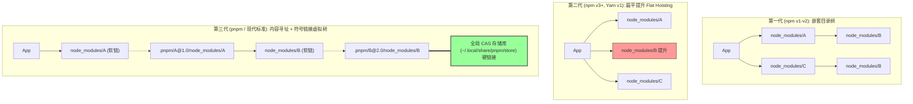

# 现代化 Node.js 与包管理前沿技术全景

本文档系统化阐述现代 JavaScript / TypeScript 服务端生态中，Node.js 运行时及包管理领域的核心技术演进、底层拓扑演进与前沿标准。

---

## 一、现代演进全景与技术范式转移

随着前端与全栈工程体系的演进，Node.js 运行时及其依赖管理体系在过去数年经历了**从“全局平铺 + 运行时黑魔法”向“声明式工具链 + 内容寻址存储（CAS）+ 原生 ESM/TypeScript + 工作区完全隔离”**的根本性范式转移：

```
┌─────────────────────────────────────────────────────────────────────────────────────────────┐
│                                 Node 生态管理架构演进对比                                      │
├───────────────────────────┬─────────────────────────────┬───────────────────────────────────┤
│ 核心维度                  │ 传统/旧式管理模式 (Legacy)   │ 现代化管理架构 (Modern Standard)  │
├───────────────────────────┼─────────────────────────────┼───────────────────────────────────┤
│ 运行时版本管理            │ nvm (慢/Shell绑定/无声明感知)│ Mise / fnm / Proto / Volta        │
│ 包管理器工具链切换        │ npm -g install yarn/pnpm   │ Corepack (packageManager 声明式)  │
│ 依赖安装拓扑              │ Flat 扁平化 Hoisting (npm)  │ Content-Addressable + 虚拟软链符号树│
│ 磁盘存储效率              │ 每个项目全量重复复制 (冗余) │ 全局单一 CAS 存储 (跨项目秒级硬链接)│
│ 依赖边界安全              │ 幽灵依赖严重 (Phantom Dep)  │ 严格依赖隔离 (非扁平化，杜绝非法引用)│
│ 模块规范支持              │ CommonJS / require / NODE_PATH│ 纯原生 ESM / exports 条件导出      │
│ TypeScript 支持           │ 必须先 tsc 编译或全套打包   │ 原生直接剥离运行 / tsx / Bun      │
│ 脚本调度与隔离            │ 全局 npm -g 污染 + NODE_PATH│ pnpm dlx / 独立 Workspace / CAS   │
└───────────────────────────┴─────────────────────────────┴───────────────────────────────────┘
```

---

## 二、现代化 Node.js 运行时版本管理

### 1. 多版本管理工具的技术演进与对比

传统的 `nvm` 基于纯 Shell 脚本编写，存在启动速度慢（导致每次打开新终端卡顿数秒）、Windows 兼容性差、跨语言支持弱等硬伤。现代运行时管理工具已全面转向 Rust 开发与声明式配置：

| 工具名称 | 核心语言 | 特点与核心机制 | 最佳适用场景 |
| :--- | :--- | :--- | :--- |
| **Mise** (原 rtx) | Rust | 多语言全能（Node, Python, Go, Rust, Bun 等），完全兼容 asdf 插件，支持声明式 `mise.toml` 与环境级变量注入，速度极快（毫秒级）。 | **多语言运维、容器基建、统一开发者环境** |
| **fnm** (Fast Node Manager) | Rust | 极度专注于 Node.js，性能极高，支持跨 Shell 自动感知 `.node-version` 与 `.nvmrc`。 | **纯 Node.js 前端开发环境** |
| **Proto** (Moonrepo) | Rust | 下一代全生命周期工具链管理器，强类型插件，针对 Monorepo 和 CI/CD 设计，支持依赖和工具链的一致性审计。 | **大型 Monorepo 与现代 CI/CD 流水线** |
| **Volta** | Rust | 基于 Shim 机制将 Node/npm/yarn 二进制绑定到项目，切换目录无需重新激活 Shell 环境变量。 | **强一致性要求的企业团队开发** |

---

### 2. Node.js 官方声明式包管理器工具链：Corepack

现代 Node.js 官方内置了 **Corepack** 机制，彻底废弃了“全局 `npm install -g yarn/pnpm`”的做法：
- **原理**：在项目的 `package.json` 中声明确切的包管理器与哈希签名：
  ```json
  {
    "name": "my-service",
    "packageManager": "pnpm@9.15.0+sha512.1370f257..."
  }
  ```
- **优势**：
  - 开发者或服务器无需提前安装 pnpm/yarn，只要执行 `corepack enable`，当运行 `pnpm install` 时，系统会自动下载对应版本的二进制并执行；
  - 杜绝因团队成员或 CI 环境本地 pnpm 版本不一致引起的 lockfile 冲突。

---

### 3. 多运行时融合生态（Node.js / Bun / Deno）

- **Node.js (20 / 22 / 24 LTS)**：
  - 原生支持 **`--experimental-strip-types`**：无需转译直接运行 `.ts` 文件；
  - 内置原生高效工具：`node --test`（零依赖测试）、`node --watch`（原生热重载）、原生 `fetch` / `WebSocket` / `crypto`；
  - 权限模型：`node --permission`（精确限制磁盘读取、网络权限）。
- **Bun**：
  - 采用 Zig 编写，集成了运行时、打包器和包管理器；
  - 安装速度相比 npm 快 10~30 倍，原生开箱即用支持 `.ts`, `.tsx`, `.mjs`, `.cjs`；
  - 对 Node.js 标准库及 npm 包具有近乎完全的兼容性。
- **Deno 2.x + JSR**：
  - 引入了向后兼容的 `npm:` 协议与 `package.json` 支持；
  - 联合推出了下一代跨运行时包注册表 **JSR**（JavaScript Registry），原生发布 TypeScript 源码并自动生成类型定义与文档。

---

## 三、现代化 Node 依赖与包管理机制

### 1. 依赖存储与目录拓扑的演化史



#### ① 扁平提升模式（Flat Hoisting）的致命缺陷
传统 `npm` 和 `Yarn v1` 将所有子依赖提升到顶层 `node_modules`，带来了两大工业级难题：
- **幽灵依赖（Phantom Dependencies）**：业务代码可以 `require()` 未在 `package.json` 中声明的次级传递依赖。一旦上游依赖升级移除该子依赖，生产环境会立即崩溃。
- **依赖分身与冗余（Doppelgangers）**：同一个包的不同版本无法同时提升，导致大量重复安装与磁盘吞噬。

#### ② 现代标准：内容寻址存储（CAS）+ 符号链接虚拟树（pnpm 架构）
现代包管理首选 **pnpm**，其核心架构设计已成为事实工业标准：
- **全局单一 CAS 库（Content-Addressable Store）**：所有包以内容哈希形式存储在全局目录（如 `~/.local/share/pnpm/store`），一台服务器上相同的包文件**物理上永远只有一份**；
- **硬链接（Hard Links）与虚拟目录（Virtual Store）**：项目安装时，通过硬链接瞬间指向全局存储（不占额外磁盘，无 I/O 拷贝消耗）；
- **严格符号链接隔离（Strict Non-flat Symlinks）**：项目根目录的 `node_modules` 中**只能看到 `package.json` 显式声明的包**，彻底杜绝幽灵依赖；
- **模块寻址天然兼容**：子依赖的解析天然沿着真实的软链接路径进行，完全符合 Node.js 原生向上查找机制，**100% 兼容 ESM 与 CJS，无需任何 `NODE_PATH` 黑魔法**。

---

### 2. 现代依赖清单编排（Catalog & Monorepo Workspaces）

现代多包/单体大仓（Monorepo）采用 **pnpm Workspaces** 配合 **Catalogs**（pnpm 9+ 核心特性）进行版本治理：

```yaml
# pnpm-workspace.yaml
packages:
  - 'apps/*'
  - 'packages/*'

# 现代特性: 统一依赖目录 (Catalogs)
catalog:
  vue: ^3.5.0
  typescript: ~5.9.0
  axios: ^1.7.0
```
在子项目的 `package.json` 中直接引用：
```json
{
  "dependencies": {
    "vue": "catalog:",
    "axios": "catalog:"
  }
}
```
**价值**：所有子模块或脚本任务共用一份依赖定义，一处升级全员同步，彻底解决 Monorepo 内部版本碎片化问题。

---

### 3. 现代模块体系：纯 ESM 与条件导出规范

现代 npm 包必须严格遵守 **Conditional Exports** 与 **Subpath Imports**：

```json
{
  "name": "modern-pkg",
  "version": "2.0.0",
  "type": "module",
  "exports": {
    ".": {
      "types": "./dist/index.d.ts",
      "import": "./dist/index.js",
      "require": "./dist/index.cjs"
    },
    "./subpath": "./dist/subpath.js"
  },
  "imports": {
    "#internal/*": "./src/internal/*.js"
  }
}
```
- **`type: "module"`**：原生开启 Top-level await，统一采用标准 `import / export`；
- **`exports` 字段**：精确定义包的公开 API 边界，防止外部直接访问私有内部文件，并支持不同调用环境的条件映射；
- **`imports` 字段**：包内部的原生路径别名支持，无需 Webpack / Vite 路径别名插件即可在 Node.js 中使用 `#internal/utils`。

---

## 四、现代化脚本执行与动态依赖模式

在调度任务或单文件脚本场景下，传统的“全局 `npm install -g` + 本地硬写代码”已被以下现代化模式取代：

### 1. 临时按需运行（Ephemeral CLI Execution: `pnpm dlx` / `bunx`）
- 传统 `npx` 会在全局缓存留下残留，且版本难以控制；
- 现代方案：`pnpm dlx <package>@<version> <args>`
  - 在隔离的临时环境中自动拉取指定版本的包，执行完成后立即释放，绝不污染系统全局环境。

### 2. 单文件内联依赖元数据（Inline Script Dependencies）
借鉴 Python PEP 723 / Deno 理念，现代 Node/TypeScript 脚本支持在文件头部直接声明自身需要的依赖：

```typescript
#!/usr/bin/env bun
// /// <reference types="node" />
// @package-spec:
// dependencies:
//   axios: "^1.7.9"
//   cheerio: "^1.0.0"

import axios from 'axios';
import * as cheerio from 'cheerio';

const res = await axios.get('https://example.com');
const $ = cheerio.load(res.data);
console.log($('h1').text());
```
调度器只需预先解析注释元数据，自动在缓存区准备对应环境，实现**真正的单文件自包含（Self-contained）脚本分发**。

---

## 五、技术选型决策矩阵

| 技术场景 | 推荐选型 (Recommended) | 次选方案 (Alternative) | 不推荐 (Deprecated) |
| :--- | :--- | :--- | :--- |
| **运行时版本管理** | **Mise** / **fnm** | Volta / Proto | `nvm` (启动慢、不可控) |
| **包管理工具** | **pnpm** (CAS + 严格软链) | **Bun** (极速安装) | `npm` (扁平提升、幽灵依赖) |
| **模块解析体系** | **Pure ESM** (`exports`) | Dual Package (CJS/ESM) | 纯 CommonJS / `NODE_PATH` 注入 |
| **TypeScript 执行** | **Node 22+ (Strip Types)** / **tsx** | **Bun** 原生执行 | 全量 `tsc` 预编译后再运行 |
| **任务临时依赖运行** | **`pnpm dlx`** / **`bunx`** | 临时 Workspace | `npm -g` 全局常驻安装 |
